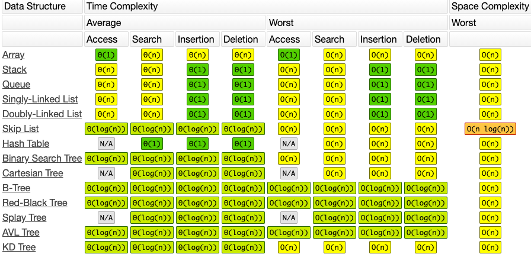

学习笔记
#总结

## 数据结构
一维  
基础：数组，链表
高级：栈，队列，双端队列，集合，映射

二维  
基础：数，图  
高级：二叉树，堆，并查集，字典树  

特殊  
位运算 ，布隆过滤器  
LRU cache  

时间复杂度

## 算法
* if-else，switch
* for，while
* 递归
* 搜索，dfs，bfs
* 动态规划
* 二分查找
* 贪心
* 数学 几何

## 学习要点

* 过遍数，五毒神掌
* 可以练习
* 反馈---题解，国际版

